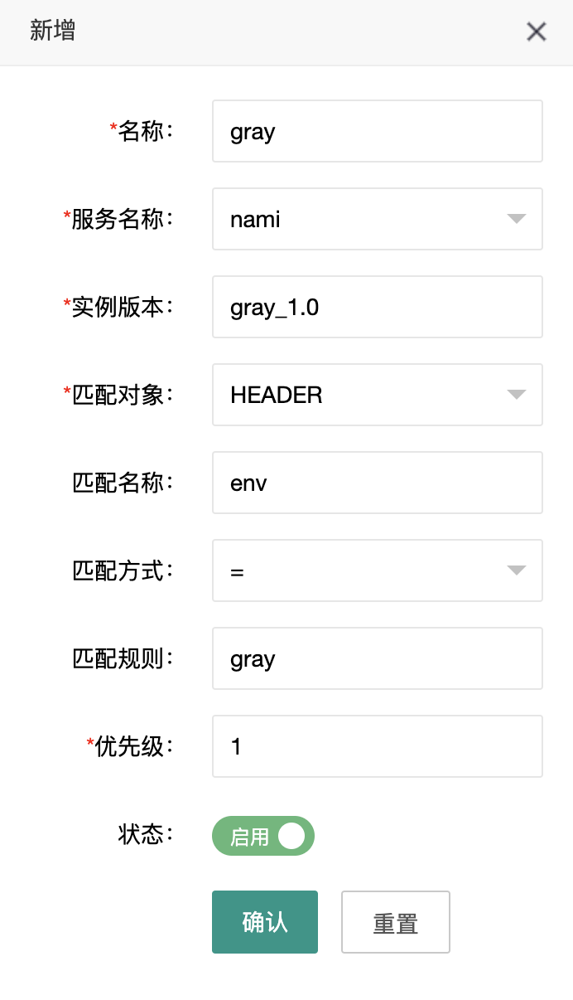

#### Nami网关
##### 实现的功能
  + 负载均衡
  + 插件链
  + 动态路由（配置灰度之类）
##### how to use nami
1. 在 localhost mysql 执行 nami.sql
2. 本地启动 nacos
```
sh startup.sh -m standalone
```
3. 启动 nami-admin
```
后台地址：http://localhost:9001/user/login/page
admin/1234
```
4. 启动两个 nami-example 实例
+ 实例1（模拟灰度机）：
```
nami:
  http:
    app-name: nami
    version: gray_1.0
    context-path: /nami
    port: 8081
    admin-url: 127.0.0.1:9001
 
server:
  port: 8081
 
nacos:
  discovery:
    server-addr: 127.0.0.1:8848
```
+ 实例2（模拟生产机）
```
ship:
  http:
    app-name: nami
    version: prod_1.0
    context-path: /nami
    port: 8082
    admin-url: 127.0.0.1:9001
 
server:
  port: 8082
 
nacos:
  discovery:
    server-addr: 127.0.0.1:8848
```
5. 在 nami-admin 后台添加路由规则配置
   
   意为 header 中的 env=gray 时，使用版本为 gray_1.0的服务
6. 启动 nami-server
   + 需等待 nami-server 控制台打印出同步过来的路由规则列表，
   方可执行测试，大概需要8-10秒的时间
   + 这些配置由 nami-admin 通过 websocket 推送过来，存入本地缓存起来 
   + 服务实例的列表通过 nacos 获取，然后根据配置的负载均衡策略选择实例发送请求
   ```
7. 配置 postman 请求测试路由
```
请求 url：http://localhost:9000/nami/user/add
header 添加：env=grey
body：
{
    "id": 1,
    "name": "nami"
}
正常会返回body的内容
```
##### 已知问题
1. 配置两条header相同的规则，可能导致路由失败（match app version error）
```
假设两条路由规则：
env=gray
env=prod
如果先新建的env=gray的规则，那么它拿到的就是env=gray的规则，
这时header设置env=prod会 match app version error。
---------------------------------------------------
发生原因：
在用Comparator拿priority字段对rule对象排序时，StackOverflow了
一时也没搞清楚怎么会这样，只好先注释了，写了一晚上脑子有点不太好使了，
之后再改吧。如果规则配的header条件不一样，或者用了其他规则一般没问题。
默认用的Round的负载均衡，也可以选Random或者Weight。
```
2. 刚才还记得，突然想不起来了... 睡觉睡觉
