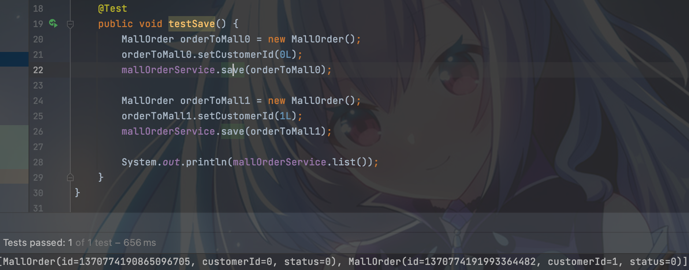
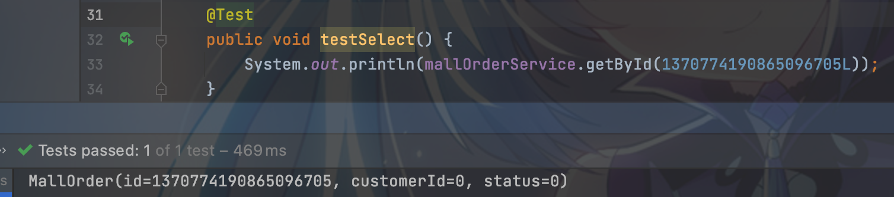
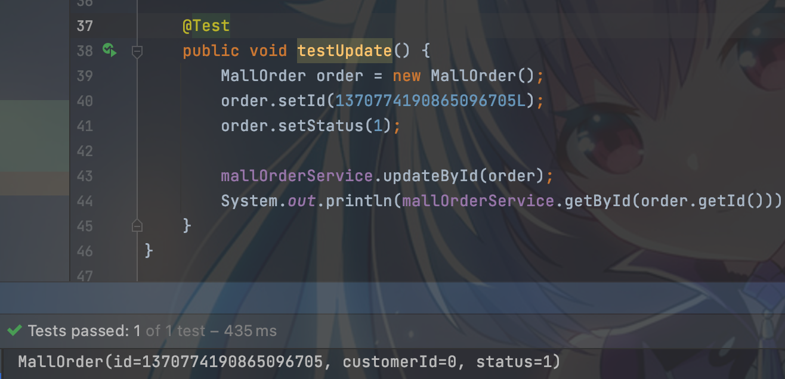
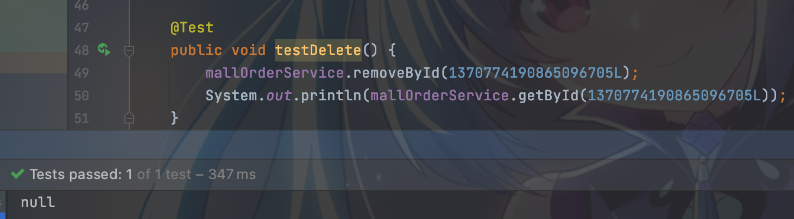

#### Week08
##### 周三
+ (必做)设计对前面的订单表数据进行水平分库分表，拆分2个库，每个库16张表。 并在新结构在演示常见的增删改查操作。代码、sql 和配置文件，上传到 Github
   - 工程名：horizontal-sharding-demo
   - config-sharding.yaml
```yaml
schemaName: mall

dataSourceCommon:
  username: root
  password: 123456
  connectionTimeoutMilliseconds: 30000
  idleTimeoutMilliseconds: 60000
  maxLifetimeMilliseconds: 1800000
  maxPoolSize: 50
  minPoolSize: 1
  maintenanceIntervalMilliseconds: 30000

dataSources:
  mall_0:
    url: jdbc:mysql://127.0.0.1:3306/mall_0?serverTimezone=UTC&useSSL=false
  mall_1:
    url: jdbc:mysql://127.0.0.1:3306/mall_1?serverTimezone=UTC&useSSL=false

rules:
  - !SHARDING
    tables:
      mall_order:
        actualDataNodes: mall_${0..1}.mall_order_${0..15}
        tableStrategy:
          standard:
            shardingColumn: id
            shardingAlgorithmName: id_mod_16
        keyGenerateStrategy:
          column: id
          keyGeneratorName: snowflake
    bindingTables:
      - mall_order
    defaultDatabaseStrategy:
      standard:
        shardingColumn: customer_id
        shardingAlgorithmName: customer_id_mod_2
    defaultTableStrategy:
      none:

    shardingAlgorithms:
      id_mod_16:
        type: INLINE
        props:
          algorithm-expression: mall_order_${id % 16}
      customer_id_mod_2:
        type: INLINE
        props:
          algorithm-expression: mall_${customer_id % 2}

    keyGenerators:
      snowflake:
        type: SNOWFLAKE
        props:
          worker-id: 123

props:
  sql-show: true
```
   - server.yaml
```yaml
authentication:
  users:
    root:
      password: 123456
    admin:
      password: 123456
      authorizedSchemas: mall
```
   - 启动
      - 使用默认配置项
        ```
        sh %SHARDINGSPHERE_PROXY_HOME%/bin/start.sh
        默认启动端口为 3307，默认配置文件目录为:%SHARDINGSPHERE_PROXY_HOME%/conf/
        ```
      - 自定义端口和配置文件目录
        ```
        sh %SHARDINGSPHERE_PROXY_HOME%/bin/start.sh ${proxy_port} ${proxy_conf_directory}
        ```
      - 命令行连接ShardingSphere-Proxy
        ```
        mysql -u${proxy_username} -p${proxy_password} -h${proxy_host} -P${proxy_port}
        ```
   - CRUD运行结果
      - 
      - 
      - 
      - 
  
##### 周日
+ (必做)基于 hmily TCC 或 ShardingSphere 的 Atomikos XA 实现一个简单的分布 式事务应用 demo(二选一)，提交到 Github
   - 工程名：atomikos-xa-demo
   - 测试类：AppTests 
     


