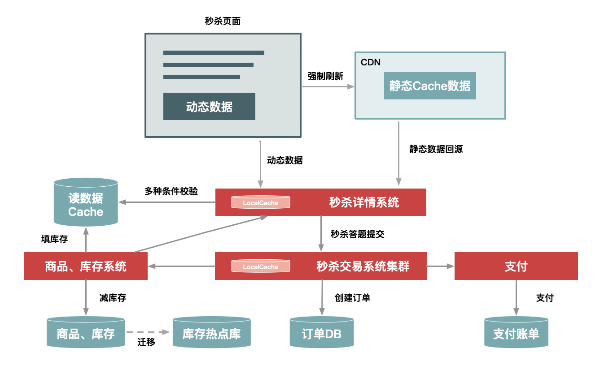

#### week-15 秒杀系统
##### 架构图（取自极客时间《如何设计一个秒杀系统》）

##### 技术要点
+ 设计原则
   - 数据尽量少，比如不展示评论区、相关推荐商品等，简化页面效果
   - 页面加载涉及的请求次数尽量少，js、css、图片等也会产生tcp握手消耗，考虑将它们多合一
   - 请求路径尽量短，从发出请求到返回结果这个过程中，经历的节点越少越好。比如将一些强关联的应用合并为一个app，或者部署在同一台机器，消除或减少rpc产生的消耗
   - 系统的外部依赖尽量少，减少弱依赖的服务系统，增加降级容错，避免被外部系统拖垮
   - 集群化部署，不能整单点
+ 数据动静分离
   - 静态数据或者很少变化的数据，可以缓存在浏览器本地或者放到CDN，以及服务端的cache（如：Redis、in JVM cache）
+ 热点发现与隔离
   - 热点操作：刷新、下单等属于用户行为，不好控制
   - 热点数据：1.静态热点：可预测的热点，如秒杀商品，提前打好标签做缓存规划；2.动态热点：推广带来的人气突然攀升
   - 优化（热点缓存） 、限制、隔离：1.系统隔离：独立域名、独立部署；2.数据隔离：独立的缓存集群、DB集群
   - 动态热点发现： 通过访问情况、日志等，汇集到中间件进行统计（异步，不影响主进程）。通过热点上报、订阅的方式发现，上游发现热点并及时通知下游进行防护
+ 请求削峰、分层过滤无效请求
   - 请求排队，同步转异步
   - 增加答题来延长秒杀时间，防止脚本
   - 分层过滤，比如使用nginx-lua插件限制ip、访问频率等
+ 服务端优化，qps，响应时间
   - 针对瓶颈优化：cpu、内存、磁盘、网络、jvm
   - 请求压缩（如gzip）、减少编码、减少序列化、Java代码优化、并发读优化
   - 硬件提升：增加机器、缓存、带宽，使用SSD等
+ 扣库存的一致性：拍下扣、付款扣、预扣
+ 高可用
   - 去行锁，商品转多行，但设计调整大
   - nginx缓存设置
   - 余量预判：超量直接返回秒杀结束
   - 主从、读写分离、中间件集群部署 
