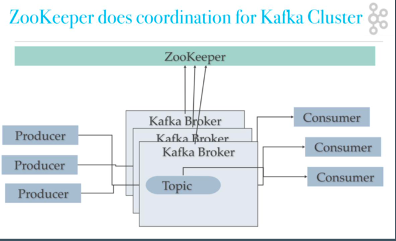
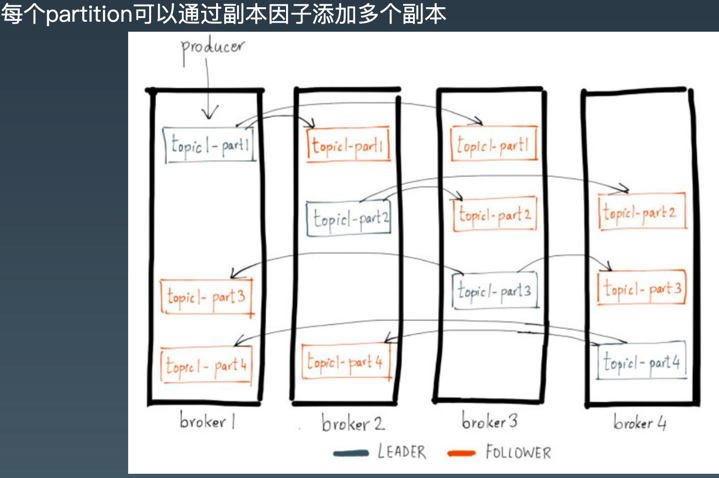

#### week-15 毕业作业
##### JVM
- - -
###### Java对象内存结构
+ 结构图
  
+ 对象头和对象引用  
  在64位 JVM 中，对象头占据的空间是 12byte(=96bit=64+32)，但是以8字节对齐，所以一个空类的实例至少占用16字节。
  在32位 JVM 中，对象头占8个字节，以4的倍数对齐(32=4*8)。所以 new 出来很多简单对象，甚至是 new Object()，都会占用不少内容。
  通常在32位 JVM，以及内存小于 -Xmx32G 的64 位JVM 上(默认开启指针压缩)，一个引用占的内存 默认是4个字节。
  因此，64位 JVM 一般需要多消耗堆内存。
+ 包装类型  
  比原生数据类型消耗的内存要多，详情可以参考 JavaWorld :
  Integer:占用16字节(头部8+4=12，数据4字节)，因为 int 部分占4个字节。所以使用 Integer 比原生类型 int 要多消耗 300% 的内存。
  Long:一般占用24个字节(头部8+4+数据8=20字节，再对齐)，当然，对象的实际大小由底层平台的内存对齐确定，具体由特定 CPU 平台的 JVM 实现决 定。 看起来一个 Long 类型的对象，比起原生类型 long 多占用了8个字节(也多消耗200%)。
- - -
###### GC对比
+ 不同分代GC搭配选择  
  
+ GC性能指标
    - 高分配速率(High Allocation Rate)  
      分配速率(Allocation rate)表示单位时间内分配的内存量。通常 使用 MB/sec作为单位。上一次垃圾收集之后，与下一次GC开始之前的年轻代使用量，两者的差值除以时间,就是分配速率。  
      简而言之就是：(YoungBefore-上次的YoungAfter) / 时间差
      分配速率过高就会严重影响程序的性能，在JVM中可能会导致 巨大的GC开销。  
      正常系统:分配速率较低 ~ 回收速率 -> 健康 内存泄漏:分配速率 持续大于 回收速率 -> OOM 性能劣化:分配速率很高 ~ 回收速率 -> 亚健康
    - 过早提升(Premature Promotion)  
      提升速率(promotion rate)用于衡量单位时间内从年轻代提升到 老年代的数据量。一般使用 MB/sec 作为单位, 和分配速率类似。  
      简而言之就是：(这次年轻代减少量-这次堆的减少量) / 时间差
      JVM会将长时间存活的对象从年轻代提升到老年代。根据分代假设，可能存在一种情况，老年代中不仅有存活时间长的对象，也可能有存活时间短的对象。这就是过早提升:对象存活时间 还不够长的时候就被提升到了老年代。  
      major GC 不是为频繁回收而设计的，但 major GC 现在也要清理这些生命短暂的对象，就会导致GC暂停时间过长。这会严重影响系统的吞吐量。
+ 新生代GC
    - Serial：单线程复制算法，eden + from -> to
    - ParNew：Serial的多线程版本
    - Parallel Scavenge： 并行复制，相对ParNew更关注吞吐量。
        + MaxGCPauseMills，GC最大停顿时间
        + GCTimeRatio，最大允许1/(1+n)的垃圾收集时间，默认值是99，即1%
        + +UseAdaptiveSizePolicy，自动调整 Xmn、SurvivorRatio、PretenureSizeThreshold
+ 老年代GC
    - Serial Old：单线程标记清除整理
    - Parallel Old：Serial Old的多线程版本，和Parallel Scavenge一样关注吞吐量
    - CMS：标记清除算法，用空闲列表来管理零散的内存空间，也可以使用 +UseCMSCompactAtFullCollection 对内存进行压缩整理，但是会导致STW更长。分为6个阶段：
        - 初始标记
        - 并发标记
        - 并发预清理
        - 最终标记
        - 并发清除
        - 并发重置
    - CMS退化为Serial Old：CMS运行期间内存无法满足程序需要，会出现 Concurrent Mode Failure，临时启动Serial Old重新处理老年代
+ G1
    - STW时间可预期可配置
    - 将堆内存划分为小块的region，对region标记属于哪个区(Eden、Survivor、Old) ，增量回收，垃圾多的region优先处理
    - Remembered Set
    - SATB（Snapshot At The Begging）
    - 垃圾回收过程
        + 年轻代  
          Eden满后应用线程暂停，将存活对象拷贝到S区。扫描GCRoots，更新RS，处理RS，复制对象，处理引用
        + 老年代  
          年轻代回收STW，并发标记老年代，重新标记STW，回收百分百为垃圾的块
        + 混合转移暂停  
          清理年轻代，将一部分老年代区域（非百分百垃圾）也回收
        + FGC
          回收失败，退化为SerialGC
- - -          
###### 参考xmind
> 
##### NIO
- - - 
###### socket
+ 模型图  
  
+ 用户空间&内核空间数据交互
  
- - -   
###### 五种IO模型
+ 同步阻塞
    - 阻塞IO：线程在等待内核准备数据时阻塞
    - IO复用：内核轮询通知线程，使用select/pull实现单线程监控多个socket
+ 同步非阻塞
    - 非阻塞IO：内核立刻返回，线程自己去轮询内核有没准备好数据
    - 信号驱动：内核给线程注册了一个reactor，内核准备好数据就发信号，reactor收到信号线程就来复制数据
+ 异步非阻塞
    - 异步IO：内核复制好再通知线程来取
- - -     
###### netty 概览
+ 架构概览
  
+ 框架特点
    - 异步
    - 事件驱动
    - 基于NIO
+ 适用范围
    - 服务端/客户端
    - TCP/UDP
+ 特性
    - 高吞吐
    - 低延迟
    - 低开销
    - 零拷贝
    - 可扩容
    - 松耦合：网络和业务逻辑分离
    - 使用方便，可维护性好
+ 兼容性
    - JDK 兼容性
        + Netty3.x: JDK5
        + Netty4.x: JDK6
        + Netty5.x: 整的改动太大，性能反不如4.x，最后凉了
    - 协议兼容性
        + 兼容大部分通用协议
        + 支持自定义协议
          — 嵌入式
        + HTTP/HTTPS Server
        + WebSocket Server
        + TCP/UDP Server
        + In VM Pipe
+ 基本概念
    - Channel  
      通道，Java NIO 中的基础概念,代表一个打开的连接,可执行读取/写入 IO 操作。 Netty 对 Channel 的所有 IO 操作都是非阻塞的
    - ChannelFuture  
      Java 的 Future 接口，只能查询操作的完成情况, 或者阻塞当前线程等待操作完成。Netty 封装一个 ChannelFuture 接口。
      我们可以将回调方法传给 ChannelFuture，在操作完成时自动执行
    - Event & Handler  
      Netty 基于事件驱动，事件和处理器可以关联到入站和出站数据流
    - Encoder & Decoder   
      处理网络 IO 时，需要进行序列化和反序列化, 转换 Java 对象与字节流。 对入站数据进行解码, 基类是 ByteToMessageDecoder。对出站数据进行编码, 基类是 MessageToByteEncoder
    - ChannelPipeline  
      数据处理管道就是事件处理器链。有顺序、同一 Channel 的出站处理器和入站处理器在同一个列表中
+ Event & Handler
    - 入站事件
        + 通道激活和停用
        + 读操作事件
        + 异常事件
        + 用户事件
    - 出站事件
        + 打开连接
        + 关闭连接
        + 写入数据
        + 刷新数据
    - 事件处理程序接口
        + ChannelHandler
        + ChannelOutboundHandler
        + ChannelInboundHandler
    - 适配器(空实现，需要继承使用)
        + ChannelInboundHandlerAdapter
        + ChannelOutboundHandlerAdapter
##### 并发编程

##### Spring和ORM等框架
- - -   
###### Spring IOC循环依赖

- - -  
###### Spring MVC

+ 过滤器(Filter):对Request请求起到过滤的作用，作用在Servlet之前，如果配置为/*可以对所 有的资源访问(servlet、js/css静态资源等)进行过滤处理
+ 监听器(Listener):实现了javax.servlet.ServletContextListener 接口的服务器端组件，它随 Web应用的启动而启动，只初始化一次，然后会一直运行监视，随Web应用的停止而销毁
   - 作用一:做一些初始化工作，web应用中spring容器启动ContextLoaderListener
   - 作用二:监听web中的特定事件，比如HttpSession,ServletRequest的创建和销毁;变量的创建、 销毁和修改等。可以在某些动作前后增加处理，实现监控，比如统计在线人数，利用 HttpSessionListener等
+ 拦截器(Interceptor):是SpringMVC、Struts等表现层框架自己的，不会拦截 jsp/html/css/image的访问等，只会拦截访问的控制器方法(Handler)。 从配置的⻆度也能够总结发现:servlet、filter、listener是配置在web.xml中的，而interceptor是 配置在表现层框架自己的配置文件中的 在Handler业务逻辑执行之前拦截一次 在Handler逻辑执行完毕但未跳转⻚面之前拦截一次 在跳转⻚面之后拦截一次
+ FlashMap 用于重定向时的参数传递，比如在处理用户订单时候，为了避免重复提交，可以处理完 post请求之后重定向到一个get请求，这个get请求可以用来显示订单详情之类的信息。这样做虽然 可以规避用户重新提交订单的问题，但是在这个⻚面上要显示订单的信息，这些数据从哪里来获得 呢?因为重定向时么有传递参数这一功能的，如果不想把参数写进URL(不推荐)，那么就可以通 过FlashMap来传递。只需要在重定向之前将要传递的数据写入请求(可以通过 ServletRequestAttributes.getRequest()方法获得)的属性OUTPUT_FLASH_MAP_ATTRIBUTE 中，这样在重定向之后的Handler中Spring就会自动将其设置到Model中，在显示订单信息的⻚面 上就可以直接从Model中获取数据。FlashMapManager 就是用来管理 FlashMap 的
- - -  
###### Spring JPA
+ 一个符合SpringDataJpa要求的Dao层接口是需要继承JpaRepository和JpaSpecificationExecutor
+ JpaRepository<操作的实体类类型,主键类型> 封装了基本的CRUD操作
+ JpaSpecificationExecutor<操作的实体类类型> 封装了复杂的查询(分⻚、排序等)
+ 使用原生sql语句查询，需要将nativeQuery属性设置为true，默认为false(jpql)
+ 方法命名规则查询
   - public List findByNameLikeAndAddress(String name,String address);
   - 按照name模糊查询(like), 方法名以findBy开头-属性名(首字母大写)
   - 查询方式(模糊查询、等价查询), 如果不写查询方式，默认等价查询
+ 动态条件封装：Specification specification = new Specification();
- - -  
###### SpringBoot
+ 如何实现自动装配：  
  参见：
##### MySQL数据库和SQL
+ MVCC详解：
  参见：
+ 思维导图：  
  参见：
##### 分库分表
+ 思维导图：  
  参见：
##### RPC和微服务
+ RPC原理
  
   - 本地代理存根: Stub
   - 本地序列化反序列化
   - 网络通信
   - 远程序列化反序列化
   - 远程服务存根: Skeleton
   - 调用实际业务服务
   - 原路返回服务结果
   - 返回给本地调用方
+ 常见RPC技术
    - Corba/RMI/.NET Remoting
    - JSON RPC, XML RPC，WebService(Axis2, CXF) 
    - Hessian, Thrift, Protocol Buffer, gRPC
+ Dubbo
   - Dubbo六大核心能力：
   - Dubbo架构： 
      + config 配置层:对外配置接口，以 ServiceConfig, ReferenceConfig 为中心，可以直接初始 化配置类，也可以通过 spring 解析配置生成配置类
      + proxy 服务代理层:服务接口透明代理，生成服务的客户端 Stub 和服务器端 Skeleton, 以 ServiceProxy 为中心，扩展接口为 ProxyFactory
      + registry 注册中心层:封装服务地址的注册与发现，以服务 URL 为中心，扩展接口为 RegistryFactory, Registry, RegistryService
      + cluster 路由层:封装多个提供者的路由及负载均衡，并桥接注册中心，以 Invoker 为中心， 扩展接口为 Cluster, Directory, Router, LoadBalance
      + monitor 监控层:RPC 调用次数和调用时间监控，以 Statistics 为中心，扩展接口为 MonitorFactory, Monitor, MonitorService 
      + protocol 远程调用层:封装 RPC 调用，以 Invocation, Result 为中心，扩展接口为 Protocol, Invoker, Exporter
      + exchange 信息交换层:封装请求响应模式，同步转异步，以 Request, Response 为中心， 扩展接口为 Exchanger, ExchangeChannel, ExchangeClient, ExchangeServer
      + transport 网络传输层:抽象 mina 和 netty 为统一接口，以 Message 为中心，扩展接口为 Channel, Transporter, Client, Server, Codec
      + serialize 数据序列化层:可复用的一些工具，扩展接口为 Serialization, ObjectInput, ObjectOutput, ThreadPool
   - Dubbo框架设计：
   - 泛化引用（GenericService）
      + 当我们知道接口、方法和参数，不用存根方式，而是用反射方式调用任何服务
         - ```
           <dubbo:reference id="barService" interface="com.foo.BarService" generic="true" />
           GenericService barService = (GenericService) applicationContext.getBean("barService");
           Object result = barService.$invoke("sayHello", new String[] { "java.lang.String" }, new Object[] { "World" });
           ```
         - ```
           ReferenceConfig<GenericService> reference = new ReferenceConfig<GenericService>(); reference.setInterface("com.xxx.XxxService");
           reference.setVersion("1.0.0");
           reference.setGeneric(true);
           GenericService genericService = reference.get();
           ```
   - 隐式传参
    > Context模式：RpcContext.getContext().setAttachment("index", "1");此参数可以传播到RPC调用的整个过程。
##### 分布式缓存
+ 思维导图：  
  参见：
##### 分布式消息队列
+ MQ的作用：
   - 异步通信:异步通信，减少线程等待，特别是处理批量等大事务、耗时操作
   - 系统解耦:系统不直接调用，降低依赖，特别是不在线也能保持通信最终完成
   - 削峰平谷:压力大的时候，缓冲部分请求消息，类似于背压处理
   - 可靠通信:提供多种消息模式、服务质量、顺序保障等
+ 主流MQ：
   - ActiveMQ
   - RabbitMQ
   - RocketMQ
   - Kafka
      + Kafka 是一种分布式的，基于发布 / 订阅的消息系统。主要设计目标如下:
         - 以时间复杂度为 O(1) 的方式提供消息持久化能力，即使对 TB 级以上数据也能保证常数时间复杂度的访问性能
         - 高吞吐率。即使在非常廉价的商用机器上也能做到单机支持每秒 100K 条以上消息的传输
         - 支持 Kafka Server 间的消息分区，及分布式消费，同时保证每个 Partition 内的消息顺序传输。
         - 同时支持离线数据处理和实时数据处理。
         - Scale out:支持在线水平扩展。
      + 基本概念：
         - Broker:Kafka 集群包含一个或多个服务器，这种服务器被称为 broker。
         - Topic:每条发布到 Kafka 集群的消息都有一个类别，这个类别被称为 Topic。 (物理上不同 Topic 的消息分开存储，逻辑上一个 Topic 的消息虽然保存于一个或 多个 broker 上，但用户只需指定消息的 Topic 即可生产或消费数据而不必关心数 据存于何处)。
         - Partition:Partition 是物理上的概念，每个 Topic 包含一个或多个 Partition。
         - Producer:负责发布消息到 Kafka broker。
         - Consumer:消息消费者，向 Kafka broker 读取消息的客户端。
         - Consumer Group:每个 Consumer 属于一个特定的 Consumer Group(可为每个 Consumer 指定 group name，若不指定 group name 则属于默认的 group)。
      + 单机部署结构：
      + 集群部署结构：   
      + topic和partition：
      + partition和replica：
      + topic特性：
         - 通过partition增加可扩展性
         - 通过顺序写入达到高吞吐
         - 多副本增加容错性
   - pulsar 
      + 
      + 

